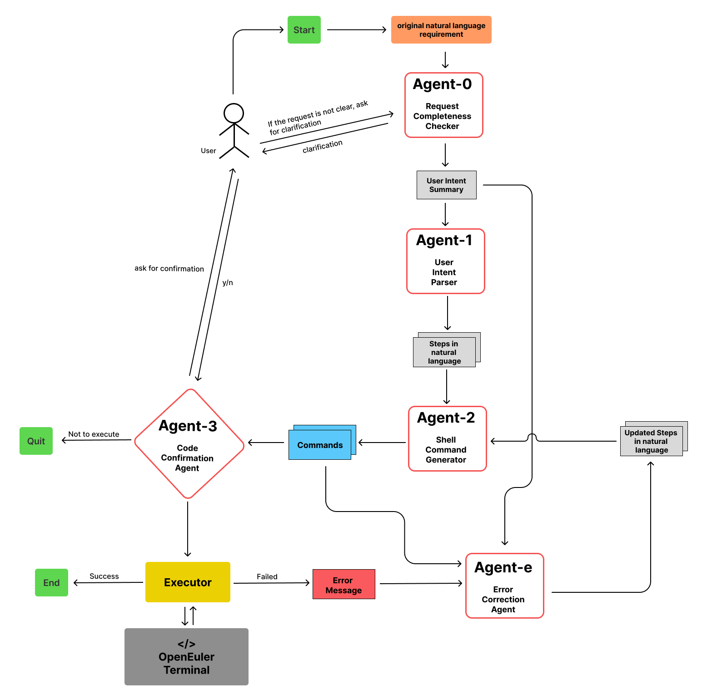
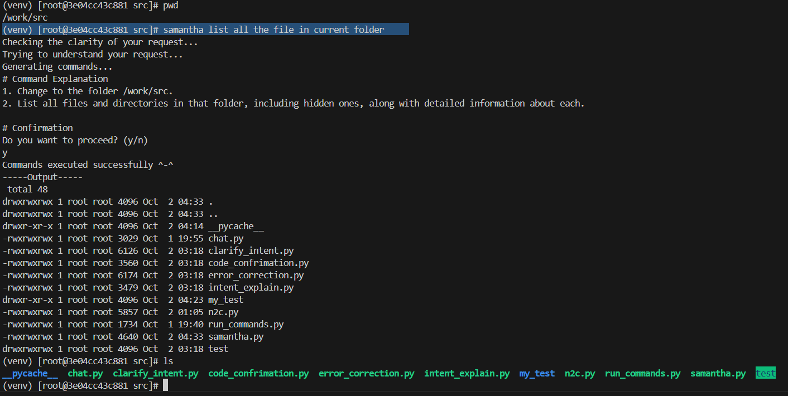
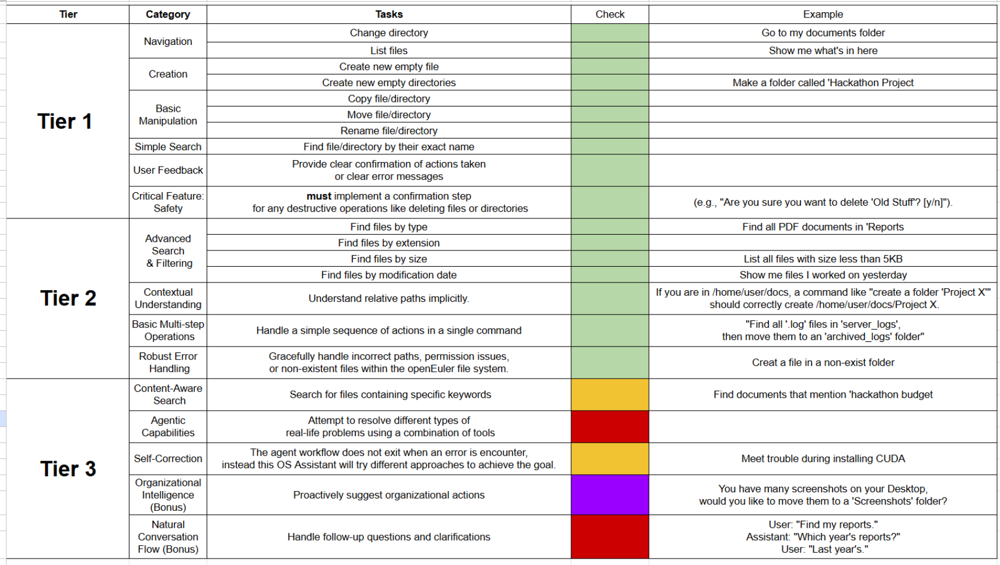
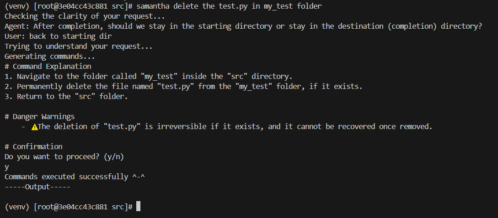
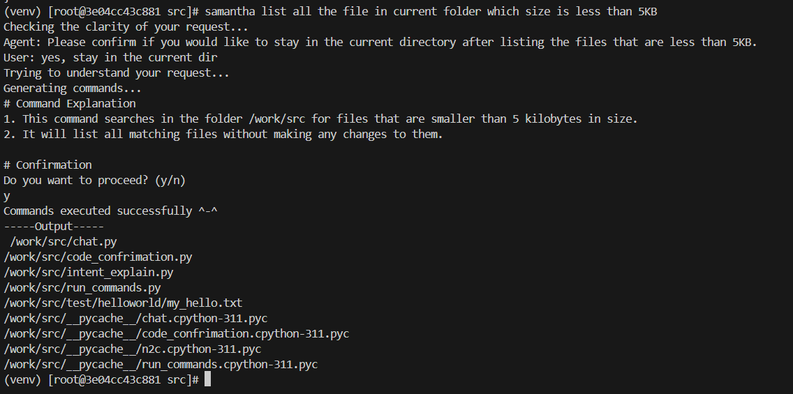
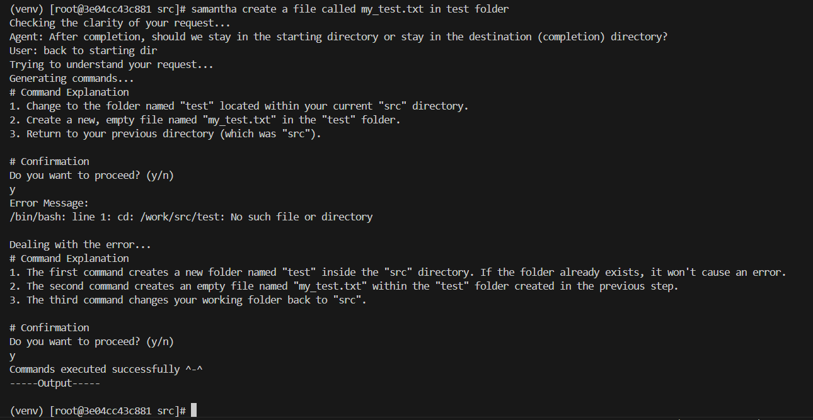
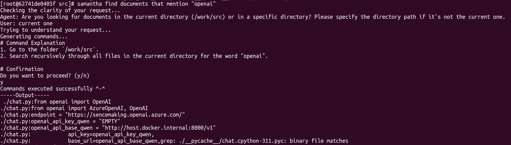
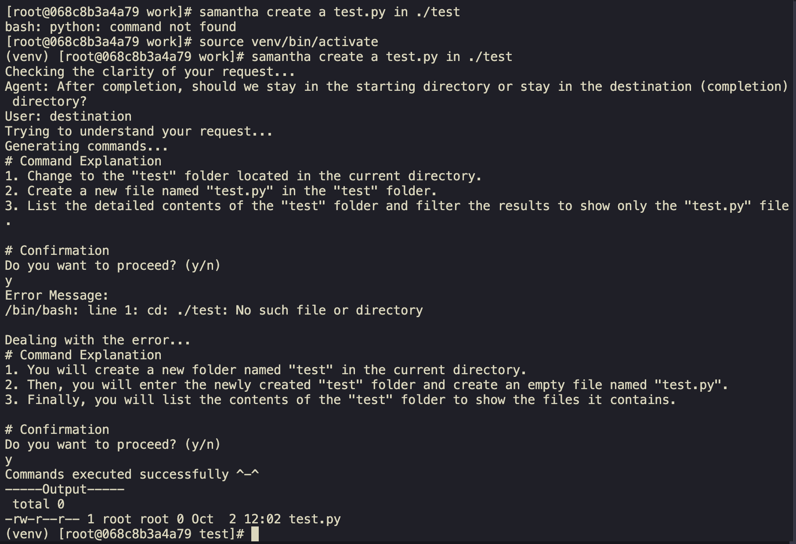
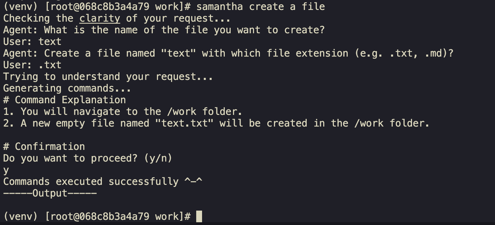
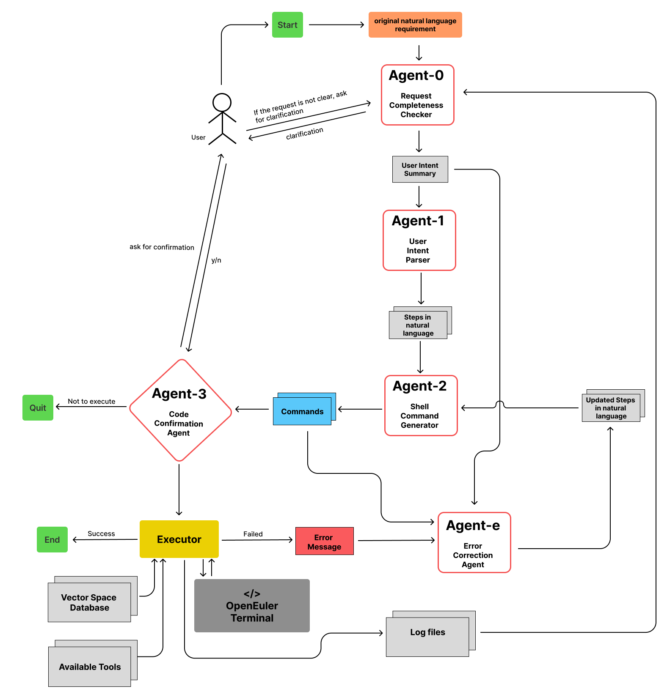

# track1_nottingDuck

## Team members

We are a team called *NottingDuck* with following three members:

- [Shuli Wang](https://github.com/NingShuZhu)
- [Yujie Yao](https://github.com/JackyYao1021)
- [Ningbo Wei](https://github.com/NingboWEI)

##  📖 User Guide

Please go to [how_to_use_Samantha](readme_help/how_to_use_Samantha.md) for detailed guidance :)

## Project description

### 1. 📌 Project Overview

**Samantha** is a natural language powered assistant that helps you interact with your system more easily.  
It can be used in your terminal on **openEuler** (and other Linux systems), which will translate natural language into executable commands, and execute them.

The current default model is the host's **Ollama `qwen3:4b`**. Direct host
execution connects to `127.0.0.1:11434`; Docker Compose connects to
`host.docker.internal:11434`. Azure fallback must be explicitly enabled.

### 2. 🏗️ System Architecture

Our system follows a multi-agent architecture that processes user natural language requests step by step until successful execution. The workflow ensures clarity, safety, and self-correction throughout the process.

The workflow is now orchestrated by **LangGraph**. `work/src/workflow.py` defines
typed state, conditional routing, clarification/approval interrupts, and the
bounded correction loop. Existing agent prompts and the `samantha <request>`
terminal entry point are retained. See [the LangGraph workflow guide](readme_help/langgraph_workflow.md)
for the graph, state lifecycle, tests, and current limitations.

- **Agent-0 – Request Completeness Checker:**  
  Validates whether the user’s natural language request is clear and executable. If key information is missing, it asks clarifying questions.

- **Agent-1 – User Intent Parser:**  
  Breaks the clarified request into structured steps in natural language, clearly defining what actions need to be performed step by step.

- **Agent-2 – Shell Command Generator:**  
  Converts these steps into robust and executable shell commands tailored for the openEuler environment.

- **Agent-3 – Code Confirmation Agent:**  
  Summarizes the commands in plain language and asks for user confirmation, especially for risky operations and permission-related actions, before execution.

- **Agent-e – Error Correction Agent:**  
  Monitors execution results. If a command fails, it analyzes the error, adjusts the plan, and sends the updated result back to Agent-2 to automatically regenerate commands and retry execution.

In addition, we designed an **efficient interaction mechanism**: after setting up _(simply using `source /work/setup.sh`)_, users can directly invoke **Samantha** in the terminal simply by typing `samantha` followed by their request, without needing to manually run a script each time.

### 3. ✅ Current Implementation & Results

Our current version of **Samantha** successfully implements all core features from **Tier 1** and **Tier 2**, as well as several features in **Tier 3**, providing a robust and intelligent natural language interface for the openEuler terminal.

#### 🧰 Tier 1 – Basic File Operations  
- ✅ **Navigation:** change directories and list files using natural language.  
- ✅ **Creation:** create new files and directories.  
- ✅ **Basic manipulation:** copy, move, and rename files or directories.  
- ✅ **Simple search:** find files or directories by exact name.  
- ✅ **User feedback:** provide clear confirmation of actions or error messages.  
- ✅ **Safety mechanism:** confirmation required for destructive operations (e.g., delete).
  
*Figure：Safety mechanism - Ask user if to permanently delete a file.*

#### ⚙️ Tier 2 – Enhanced Intelligence  

- ✅ **Advanced search and filtering** by type, extension, size, or modification date.  
  
*Figure：example of Advance search - file filtering by size.*
- ✅ **Context awareness:** understands relative paths and context implicitly.  
- ✅ **Basic multi-step operations:** handles sequences of actions in a single request.  
- ✅ **Robust error handling:** gracefully handles invalid paths, permission issues, and missing files.
  
*Figure：example of Robust error handling - create a file in non-exist folder.*

#### 🚧 Tier 3 – More advanced  

- ✅ **Content-Aware Search:**  able to search for files ontaining specific keywords. 

*Figure：example of keyword search - find all the files include "openai".*
- ✅ **Self-Correction:** when an error is encounter, Samantha will try different approaches to achieve the goal. (Up to _three_ self-correction attempts will be tried)

*Figure：example of self correction.*
- ✅ **Natural Conversation Flow:** Samantha can handle follow-up questions and clarifications. In case the request is not clear, she will ask for clarification until she exactly get your point. If during the conversion you don't want her to execute the request anymore, she will simply do nothing and exit.

*Figure：example of asking for clarification.*

Durable interaction logging now records every user turn, terminal response,
workflow operation, approval, execution result, error, and retry in SQLite.
Use `samantha history list`, `samantha history show latest`, or
`samantha history export latest --output session.json`. See
[the interaction logging guide](readme_help/interaction_logging.md) for storage,
event format, exports, and verification. Organizational intelligence and
automatic recall of prior conversations remain future work.

### File and Image Content Search

The content pipeline now supports native text, DOCX, PDF pages, and images:
Qwen2.5-VL generates descriptions/OCR, summaries, and tags; BGE-M3 encodes the
content; Qdrant provides persistent retrieval and metadata filtering. Use
`samantha content index <path>`, `samantha content search <query>`, and
`samantha content ask <question>`. Run `samantha content doctor` to check models.
See [the content search guide](readme_help/content_search.md) for installation,
hybrid versus Ollama dense mode, configuration, and limitations.

## 🚀 Future Work

Although our current implementation focuses on Tier 1 and Tier 2 functionality, we have laid a solid foundation for future development towards these Tier 3 and more advanced intelligent capabilities.

The following extensions are planned:

*Figure：Architecture for the future development*

- **Persistent checkpoints and memory:** Durable interaction, execution, and error logs are implemented. The graph still keeps checkpoints in memory for one process; cross-process workflow resume and automatic conversation recall remain future work.
- **Vector database:** Qdrant-backed content search is implemented. Automated deletion/move synchronization and visual-similarity embeddings are future extensions.
- **External tools:** LangGraph orchestration is implemented. Additional tools beyond the Bash executor can be introduced through dedicated nodes.

