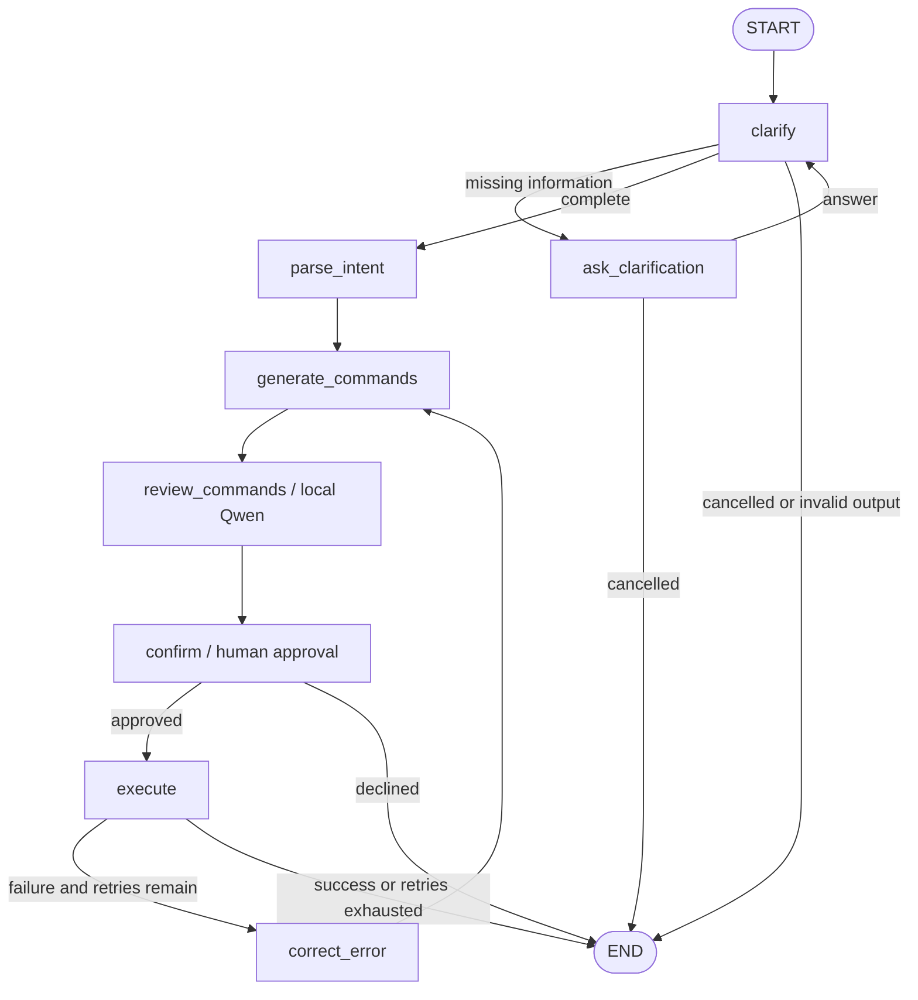

# LangGraph workflow

Samantha uses LangGraph 1.2.12 to orchestrate the existing model roles. The model
transport remains the existing OpenAI-compatible client; no LangChain model
adapter is required. Runtime requirements are Linux/Bash and Python 3.10+.
The default backend is the host's Ollama `qwen3:4b`; container configuration and
live model tests are described in [the setup guide](how_to_use_Samantha.md).

## Graph



An agent/provider exception or invalid structured output also ends the graph
with `status="failed"`. Command failures allow at most three corrections,
which means at most four approved executions in total.

## State and human input

`work/src/workflow.py` defines `SamanthaState`, including:

- Original input, the latest clarification answer, and clarification history.
- Non-empty clarification answers paired with the questions they answer.
- Clarification question count and its independent limit (three by default).
- Clarified request, final-directory choice, natural-language plan, and commands.
- Structured command review, confirmation text, approval, correction count,
  execution result, and terminal status.
- Review and approval identities covering the exact command sequence, starting
  working directory, and Bash executable.
- Initial directory, directory to return to the caller, and failure details.

`ask_clarification` and `confirm` use `interrupt()`. The terminal adapter in
`work/src/samantha.py` prints the interrupt payload, reads input, and resumes
with `Command(resume=answer)` under the same `thread_id`.

After a clarification answer, the model's latest user message explicitly contains
the original task, the previous question, and the new answer. Raw user text and
questions remain in `clarification_history`; the wrapper is not appended there.
This lets a short answer such as `binary_search` supply a file name while retaining
the original request to write Python binary search code. Existing terminal history
does not replace the current invocation's original task.

Earlier answers are also included as explicit question/answer pairs in the latest
message. A bare name answering an explicit file/directory naming question is
labeled as a supplied name. For a request explicitly asking for a Python file or
script, a literal file name without an extension gains `.py`. Existing extensions
and directory names are preserved; sentences, paths, and uncertain replies are
left for the model to interpret. This is a conservative naming rule, not a general
task-slot parser.

Blank answers are re-prompted in the interrupt node without a model call or a
history update. Three consecutive blank answers end the task with `status="failed"`.
A repeated question after a non-empty answer also fails with an explanation;
comparison ignores letter case, whitespace, and trailing sentence punctuation.
Rephrased questions are bounded by `max_clarifications`, configurable through
`initial_state(..., max_clarifications=...)`. The final allowed answer can still
complete the task. These limits are separate from command-error `max_retries`.

Model calls are separate from interrupt nodes. LangGraph restarts an interrupted
node when it resumes, so this separation prevents duplicate model calls while
waiting for a user. Command execution occurs only after approval; each regenerated
command list resets approval and passes through confirmation again.

## Independent command reviewer

`work/src/command_review.py` replaces the old explanation-only role with an
independent reviewer. The graph runs `generate_commands -> review_commands ->
confirm -> execute`. The reviewer receives the original request, clarified
request, current plan, exact ordered commands, starting directory, Shell,
and previous error. It has no tools and never executes, changes, or approves
commands. It reuses `QWEN_BASE_URL`, `QWEN_MODEL`, `QWEN_API_MODE`, and
`QWEN_TIMEOUT`; the defaults target local Ollama `qwen3:4b`. Azure fallback is
disabled for this role even when enabled for other agents.

The reviewer returns validated JSON with `verdict` (`reasonable`, `issues_found`,
or `insufficient_information`), `risk` (`low`, `medium`, `high`, or `unknown`),
`summary`, `effects`, `issues`, `uncertainties`, and `recommendation`. It uses
the user's language for prose. The terminal shows this natural-language review,
the actual working directory, Shell, and original commands before asking
`Proceed? (y/n)`. Chinese requests also accept `确认`, `同意`, `执行`, or `是`.
Findings are advisory: even a favorable review always waits for human approval,
and a user can reject or explicitly approve a command with reported issues.
If a small model reports concrete issues but emits a conflicting favorable
verdict, validation promotes the verdict to `issues_found` and retains its findings.

Reviews are stored in `command_review`; `confirmation_note` contains the
formatted explanation. `agent.review_commands`, graph updates, interrupt
payloads and approval decisions are captured by the existing interaction log.
The former `code_confrimation.py` helper remains available for standalone use,
but the graph no longer calls it or an extra explanation model.

A SHA-256 action identity binds the review and approval to the exact commands,
starting working directory, and Shell executable. A changed action fails before
confirmation or execution. Corrected commands clear both identities and get a
new review and user approval. Resuming a confirmation does not call Qwen again.
Invalid, truncated, or unavailable review output ends with `status="failed"`
before execution. The reviewer has no filesystem inspection; file existence,
permissions, and unknown script contents must be reported as uncertainties.

These patterns follow the official [interrupt documentation](https://docs.langchain.com/oss/python/langgraph/interrupts)
and [Graph API](https://docs.langchain.com/oss/python/langgraph/graph-api).

The default checkpointer is `InMemorySaver`, scoped to one process. It supports
pause/resume during the current invocation, but does **not** restore a session
after the process exits. `build_workflow(..., checkpointer=...)` accepts a different
checkpointer for future durable storage; persistent session IDs and a resume
entry point would also be needed.

The terminal adapter now uses a durable SQLite interaction journal independently
of those graph checkpoints. Each invocation's journal session ID is also its
LangGraph `thread_id`. User turns, terminal output, service inputs/results,
approval updates, shell execution, errors, and retries are committed as they
happen. See [interaction logging](interaction_logging.md) for history commands
and the event schema. Reading a saved log does not resume or replay commands.

## Terminal integration

The existing `samantha <request>` shell function remains the entry point.
It captures the source directory when loaded, creates a unique file with
`mktemp`, and passes its location as `SAMANTHA_STATE_FILE`. Python initializes
that file with the starting directory before model calls and writes the final
directory when finished. Bash reads JSON with Python and removes the file.

There is no shared `/tmp/current_dir.json`, so an old invocation cannot change
the directory of a cancelled or failed invocation. A direct Python invocation
returns results without changing the caller's shell directory.

## Offline verification

Install the dependencies, then run from the repository root:

```bash
python3 -m pip install -r work/requirements.txt
python3 -m unittest discover -s work/tests -v
bash work/tests/shell_smoke.sh
```

On Windows, the existing virtual environment can run these graph tests:

```powershell
.\.venv\Scripts\python.exe -m unittest discover -s work/tests -v
```

The tests use real LangGraph execution with injected fake agents and a fake
executor. They cover approval gating, repeated clarification, cancellation,
correction limits, review validation, provider isolation, changed-action blocking,
failures, independent thread state, and directory results. They require no model
credentials or actual command execution.
The separate shell smoke test checks directory changes, cancellation, failure
status, relative sourcing, and temporary-file cleanup using a fake CLI.

## Remaining limitations

- The Bash executor (`/bin/bash`, or `SAMANTHA_BASH` when explicitly configured)
  still runs model-generated shell strings with the process's
  permissions. Confirmation and graph routing do not provide a sandbox or a
  deterministic command policy.
- Model review can miss mistakes. Approval identity checks do not freeze files,
  environment variables, PATH, or executable contents while waiting for approval.
- A failed command sequence can leave partially completed file operations. A
  correction may repeat earlier steps; rollback and per-step execution tracking
  are future work.
- The current executor has no timeout or output-size limit.
- Cross-invocation conversation recall, durable workflow resume, and additional
  shell-workflow tools remain future work. Persistent interaction logging and
  Qdrant-backed content retrieval are implemented separately.
